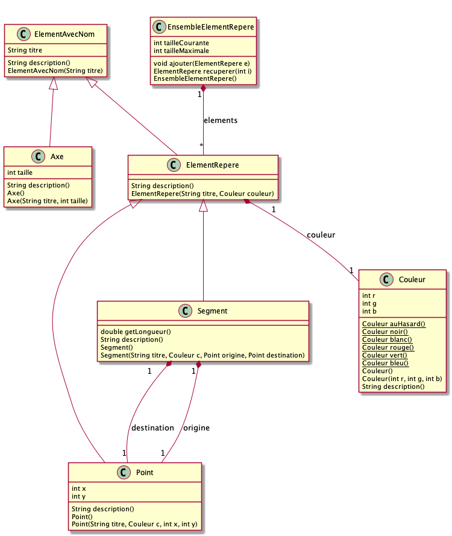

# TP 1

Au cours de ce TP, nous allons implémenter les classes `Axe`, `Droite`, `Point`, `EnsembleElementsRepere` et `Couleur`. Avant de détailler le travail à effectuer voici quelques rappels. Tout d’abord, lisez la documentation des classes Java lorsque cela est nécessaire. Pour rappel, recherchez `javadoc NomClasse` sur Google.

En Java, on place une classe par fichier. Pour l'instant elles doivent se trouver dans le même repertoire, ce qui rend les `import` inutiles. Si la classe est définie comme `class Foo` elle doit se trouver dans le fichier `Foo.java`. N'oubliez pas que les noms de classes (et donc des constructeurs) commencent par une majuscules, tous les autres identifiants commencent par une minuscule.
Pour compiler un fichier `Foo.java`, utilisez la commande `javac Foo.java` puis lancez le programme avec `java Foo`. La classe que vous exécutez doit contenir une méthode `public static void main(String[] args)` qui est le point d’entrée du programme. Pour compiler plusieurs fichiers ensembles, lancez `javac *.java` ou `javac fichier1.java fichier2.java`.

Pensez à compiler et tester très rapidement le code que vous écrivez. Pour cela utilisez la classe fourni ci-après qui contient un point d’entrée. Utilisez ce point d’entrée pour compiler et tester le code que vous écrivez. Moins vous êtes sûr de vous, plus souvent vous devez effectuer cette opération.

La figure ci-dessous détaille la structure des classes que vous devez coder. **Attention, cette structure n'inclus pas, afin de ne pas polluer le schéma, les accesseurs et les mutateurs**. La suite de l’énoncé de TP précise les fonctionnalités que vous devez implémenter. Suivez l'ordre des question quand vous réalisez le TP.

## Classe de test

Pour vous aider, voici une [classe](src/main/java/Tests.java) qui vous permettra de tester votre programme.

## Fonctionnalités

Voici les fonctionnalités à développer.

### Gestion des couleurs (facile)

Les composantes `r`, `g` et `b` d’une couleur doivent être comprises entre 0 et 255. Si une composante n'est pas comprise entre 0 et 255 alors il faut quelle soit ramenée dans cet intervalle (0 pour une valeur inférieure à 0 et 255 pour une valeur supérieure à 255).

En outre la classe couleur doit fournir plusieurs méthodes statiques qui créent des couleurs prédéfinies. Définissez aussi une méthode `Couleur auHasard()` qui renvoie un couleur au hasard avec des valeurs `r`,`g` et `b` aléatoirement générées (astuce : regardez du coté de la classe `Random`).

### Gestion des axes (facile)

Une spécificité de la classe `Axe` est que son titre soit en majuscule. Proposez une solution pour assurer cette contrainte, même si l’utilisateur fournit un titre comportant des minuscules. De la même manière, la taille d'un axe doit être toujours supérieure ou égale à 0, si l'utilisateur fournit une taille négative elle doit être ramenée à zéro.

### Gestion des Points (facile)

Similairement à la classe `Axe`, les coordonnées d'un point sont nécessairement positives ou nulles. Si un utilisateur fournit une coordonnée négative, elle doit être ramenée à zéro.

### Constructeurs (moyen)

Chaque classe doit avoir deux constructeurs : un constructeur sans paramètre qui crée un objet avec des valeurs par défaut, et un constructeur permettant de donner une valeur à tous les attributs de la classe. Les constructeurs doivent utiliser le mécanisme de redéfinition pour éviter les duplications de code (Utilisation du mot-clé `super`).

### Affichage (moyen)

Définir ou redéfinir pour chaque classe les méthodes `String description()` pour obtenir les affichages suivants (bien entendu il faut utiliser les valeurs réelles et pas x, y, etc...):

* `Point` affiche `Point (x,y), couleur : (r,g,b), titre: titre`
* `Droite` affiche `Droite (x1,y2) -> (x2,y2), couleur : (r,g,b), titre: titre`
* `Axe` affiche `Axe taille : taille, titre : titre`

Les méthodes `String description()` doivent utiliser le mécanisme de redéfinition pour éviter au maximum les duplications de code (invocation des méthodes `description()` des super-classes). Exécutez à nouveau le fichier de test et vérifiez que vous obtenez l’affichage escompté.

### Stockage des points et droites (difficile)

La classe `EnsembleElementRepere` doit stocker des éléments de type `Droite` et `Point`. Il est à noter que cet élément de stockage est de taille dynamique, on doit toujours pouvoir rajouter de nouveau éléments. Cette classe doit être programmée en utilisant en interne un tableau de taille fixe (rappel : création d’un tableau de taille 10, on écrit `int[] t = new int[10]`). Définissez tout d’abord la méthode `ajouter(ElementRepere e)` qui permet d’ajouter un élément dans l’ensemble. Ensuite, écrivez la méthode `ElementRepere recuperer(int i)` qui permet de récupérer le i-ème élément de l'ensemble.
